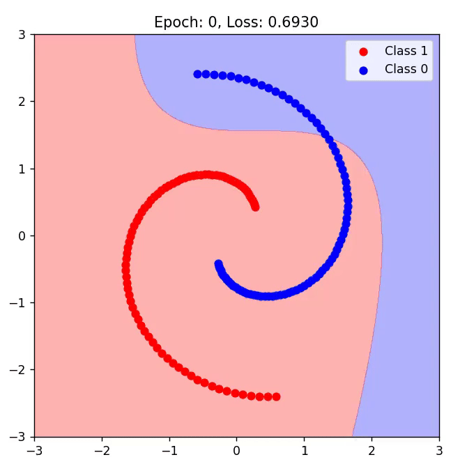
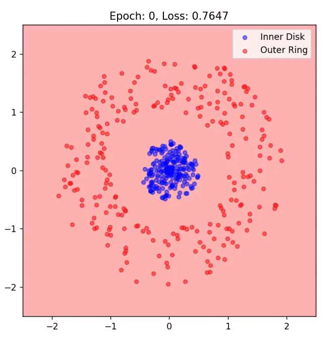
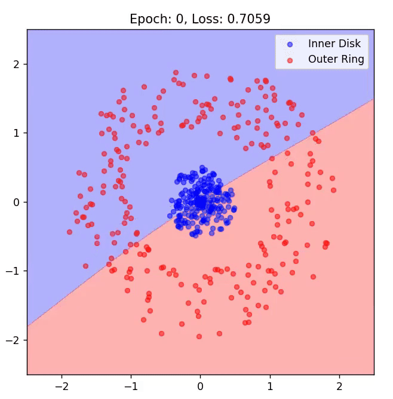
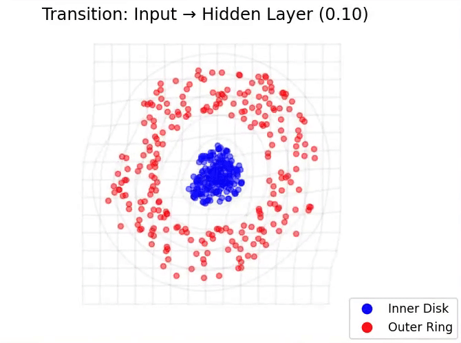

# Neural Networks and the Manifold Hypothesis

This project visually explores how neural networks simplify complex data into more understandable representations - a concept known as the **[manifold hypothesis](https://en.wikipedia.org/wiki/Manifold_hypothesis)**. It demonstrates how neural networks progressively reshape high-dimensional data, making it easier to classify and interpret.

## What is a Manifold?

A **manifold** is a mathematical concept describing a space that looks simple when zoomed in locally but might have a more complicated overall shape. In machine learning, data often lies on these lower-dimensional surfaces (manifolds), even when initially appearing complicated and high-dimensional.

## The Manifold Hypothesis Explained

The manifold hypothesis suggests that real-world data, despite being very complex, actually lies close to simpler, lower-dimensional shapes or surfaces embedded within their original high-dimensional space. Neural networks use this property to learn effectively by reshaping data into more manageable forms.

## Why is this Important for Neural Networks?

Neural networks are powerful because they transform complicated, overlapping data into distinct groups that can be easily separated. By progressively reshaping these manifolds, networks:

- Simplify complex patterns in data.
- Create representations where data points from different categories become easier to separate.
- Improve the accuracy and efficiency of classification tasks.

## Spirals Dataset: Unraveling Complex Patterns

- **Dataset**: Two tightly intertwined spirals representing challenging classification data.
- **Visualization Highlights**:
  - Step-by-step transformation of data by network layers.
  - Creation of clear boundaries for classification.
  - Importance of nonlinear activation functions.
 
    
- **Neural Network Training** (decision boundary forming):
<p align="center">
  
</p>

- **Feature Space Transformations** (at each layer):
<p align="center">
  
</p>

## Disk & Ring Dataset: Simplifying Radial Data

- **Dataset**: Points forming an inner disk (class 0) surrounded by an outer ring (class 1).
- **Visualization Highlights**:
  - How layers reshape radial data for easier separation.
  - Visual comparison of transformations in 2D and 3D hidden layers.
  - Real-time evolution of decision boundaries during network training.

- **Network Training: 2 hidden units (left) vs. 3 hidden units (right)**
<p align="center">
  
  
</p>

- **Feature Space Transformations: 2 hidden units (left) vs. 3 hidden units (right)**:
<p align="center">
  
  
</p>

### MNIST Dataset: Simplifying Digit Recognition

- **Dataset**: Classic MNIST dataset of handwritten digits.
- **Visualization Highlights**:
  - Transition from high-dimensional images (784 pixels) to simpler internal features.
  - [PCA](https://en.wikipedia.org/wiki/Principal_component_analysis) (Principal Component Analysis) projections show how clearly digits separate in deeper layers.
  - How neural networks naturally cluster similar digits.

- **Feature Space Transformation** of MNIST digit classification (using PCA):
<p align="center">
  
</p>

## Project Structure

```
.
├── utils/
├── manifolds_spirals.py   # Spiral dataset visualization
├── manifolds_disks.py     # Disk and ring dataset visualization
├── manifolds_mnist.py     # MNIST digits visualization
└── README.md              # Project overview (this document)
```

## Running the Project

### Setup

First, install the required Python libraries:

```bash
pip install torch torchvision numpy matplotlib scikit-learn
```

### How to Run

Execute the provided scripts separately to visualize:

```bash
python manifolds_spirals.py
python manifolds_disks.py
python manifolds_mnist.py
```

Each script generates interactive animations showing how neural networks transform and classify data.

---

## Resources

- [Neural Networks, Manifolds, and Topology (Chris Olah)](https://colah.github.io/posts/2014-03-NN-Manifolds-Topology/)
- [Understanding the Manifold Hypothesis (Visual Introduction)](https://igreat.github.io/blog/manifold_hypothesis/)
- [The Manifold Hypothesis for Gradient-Based Explanations (Bordt et al.)](https://arxiv.org/abs/2206.07387)
- [Separability and Geometry of Object Manifolds (Nature)](https://www.nature.com/articles/s41467-020-14578-5)
- [Why Deep Learning Works: A Manifold Disentanglement Perspective (Brahma et al.)](https://ieeexplore.ieee.org/document/7348689)
